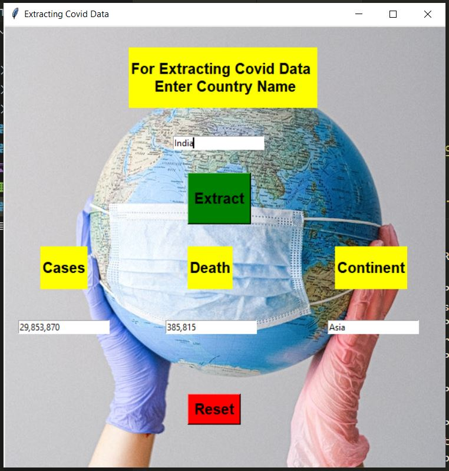

# Extract Covid-Data

The corona virus is one of the biggest pandemics that put the world at risk. At the same time, this is one of the most trending messages that all these days have. In this article, we will Extract data and provide Covid-19 statistics in a human-readable form and store the data in an Excel sheet. You can scrap the data with [this link](https://www.worldometers.info/coronavirus/countries-where-coronavirus-has-spread/) . we have also build its gui using tkinter which recieve country name as input from user and give output as conformed case , death no. and continent in which country belongs .


## Contributing

Contributions are always welcome!

If you have some great idea that add some more value to this project or you find any bugs then feel free to open an issue and contribute to project.

  
## Installation 

Install the required libraries .

```bash 
  pip install bs4
  pip install texttable
  pip install requests
  pip install tkinter
```
    
## License

[MIT](https://choosealicense.com/licenses/mit/)

  
## Screenshots


<p align="center"></p>

  
